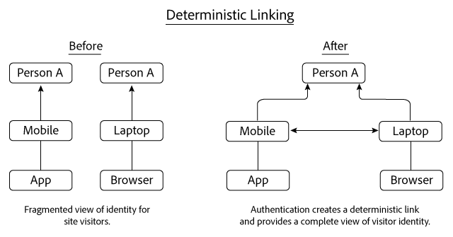

# Deterministiska och sannolika länkar{#deterministic-and-probabilistic-links}

Hur Device Graph analyserar deterministiska och sannolika data för att skapa en karta som länkar samman enheter.

I [!DNL Device Graph]det bygger interna processer en identitetshierarki som mappar enheter och kopplar dem till enskilda, anonyma personer. Diagrammets utdata innehåller länkar mellan olika enheter som du kan använda för målinriktning tillsammans med data som visas i utvalda Experience Cloud-lösningar. De Adobe-lösningar som fungerar med [!DNL Device Graph] data är Analytics, Audience Manager, Media Optimizer och Target.

Analyserar [!DNL Device Graph] deterministiska och sannolika data för att skapa en karta som länkar samman enheter. Deterministiska data länkar samman enheter baserat på hash-kodad inloggningsinformation. Sannolikheten att data länkar samman enheter baserat på information som IP-adresser och andra metadata. De [!DNL Device Graph] associerar de länkade enhetskluster med en anonym person. Med dessa anslutningar kan digitala marknadsförare nå människor istället för enheter. I [!DNL Device Graph]är ägaren till en enhet en anonym representation av en person i verkligheten. Både deterministiska och sannolika länkar hjälper till att bygga upp en struktur för användaridentitet.

>[!NOTE]
>
>I Adobe Experience Cloud Device Co-op har termer som *enhet*, *person* och *identitet* en specifik betydelse. Till exempel kan *enheten* referera till fysisk maskinvara som en telefon eller surfplatta och de program som körs på den maskinvaran. Definitioner finns i [ordlistan](../glossary.md#glossgroup-0f47d7fbd76c4759801f565f341a386c) .

## Vad är länkar? {#section-2df4c6f01eba49369993146df0661f13}

När vi pratar om länkar är det viktigt att tänka på vilka de verkligen är i sammanhanget med [!DNL Experience Cloud] Device Graph. I det här sammanhanget är länkar inte fysiska anslutningar mellan enheter. I stället är en länk hur Device Graph kopplar olika enheter till samma okända person. Anta till exempel att vi har en mobiltelefon och en webbläsare på datorn. Telefonen och webbläsaren kan betraktas som länkade när Device Graph fastställer att båda enheterna används av samma okända person. Som du kommer att läsa nedan skapar Device Graph identiteter med deterministiska och sannolika länkar. Och i Device Graph är ägaren av en enhet den anonyma representationen av en riktig person.

## Deterministiska länkar {#section-33d41e828a674b398e36fe63da20ac09}

Deterministiska länkar associerar en enhet med en person baserat på en autentiseringshändelse (t.ex. en inloggningsåtgärd till en plats från en enhet). Den här åtgärden skapar en anonym identifierare som kallas konsument-ID. Låt oss titta på hur deterministisk länkning fungerar. I det här exemplet loggar person A in på en nyhetswebbplats via en app på sin mobila enhet. Senare den dagen loggar person A in igen, men den här gången via en webbläsare på sin bärbara dator.

Baserat på inloggningsinformationen, enhetsgrafen:

* Känns till att person A autentiserade sig på nyhetswebbplatsen med en kombination av mobiltelefon/app och bärbar/webbläsare.
* Länkar dessa enheter till person A.
* Skapar en identitet baserad på länkade enheter som är kopplade till en anonym person.

>[!NOTE]
>
>Varken [!DNL Adobe Experience Cloud Device Co-op] eller [!DNL Device Graph] mottar faktisk autentiseringsinformation eller personligt identifierbar information i dessa data. Medlemmar i [!DNL Experience Cloud Device Co-op], skicka kryptografiskt hashas, unika konsument-ID:n till Device Graph. Konsumentens ID representerar en autentiserad användare i diagrammet och skyddar konsumenternas integritet.

## Troliga länkar {#section-5f5aa755da984f9d851f7cb380262998}

Sannolikhetslänkar ansluter en enhet algoritmiskt till en person baserat på egenskaper och metadata som:

* Bläddringsbeteende
* IP-adresser
* Operativsystem
* IDFA- och GAID-identifierare

Låt oss titta på hur sannolik länkning fungerar. I det här exemplet bläddrar person A till en nyhetswebbplats på sin surfplatta och sedan från en dator. Personen A loggar inte in på nyhetswebbplatsen när han surfar. Under varje enskilt besök delar surfplattan och datorn samma IP-adress.

Baserat på den här informationen utvärderar [!DNL Device Graph] IP-adressdelningsmönster mellan båda enheterna och länkar samman dessa enheter om resultaten tyder på att de tillhör person A. Slutresultatet är en hierarki av identitet som härleds från algoritmiska sannolikhetsberäkningar.

I det här exemplet länkade Device Graph båda enheterna när de användes för att få åtkomst till samma nyhetswebbplats. Men enheter behöver inte ses på samma webbplats för att kunna länkas. För att illustrera detta kan vi säga att varje enhet i det här exemplet besöker helt olika webbplatser. Algoritmen kan fortfarande skapa en sannolikhetslänk baserat på den delade IP-adressen och på en analys av andra data. [!DNL Device Graph] Det är den här processen som gör att en sannolik länkning blir så kraftfull för medlemmar i Device Co-op [!DNL Experience Cloud] .

## Båda datatyperna ger värde {#section-43d22d8c10634edcb261e7bda6fdf323}

Deterministisk och sannolik datainsamling som kompletterar varandra. Ett enhetsdiagram som bara innehåller deterministiska data ger dig däremot en begränsad bild av en persons identitet. Utan autentisering kan ett enhetsdiagram inte informera dig om andra enheter och personer som surfar på platsen. Sannolikhetsdata kan skapa sådana kopplingar och hjälpa er att nå oautentiserade enheter, människor och hushåll.

deterministiska data är dock också viktiga. Det kan till exempel förbättra det sannolika beslutsfattandet genom att ta bort falska länkar som genereras på platser där sannolikhetssignaler är troliga och överlappande (t.ex. kaféer, bibliotek, flygplatser osv.).

Med båda datatyperna ger Device Graph en mer heltäckande bild av en persons identitet än med båda typerna var för sig.

